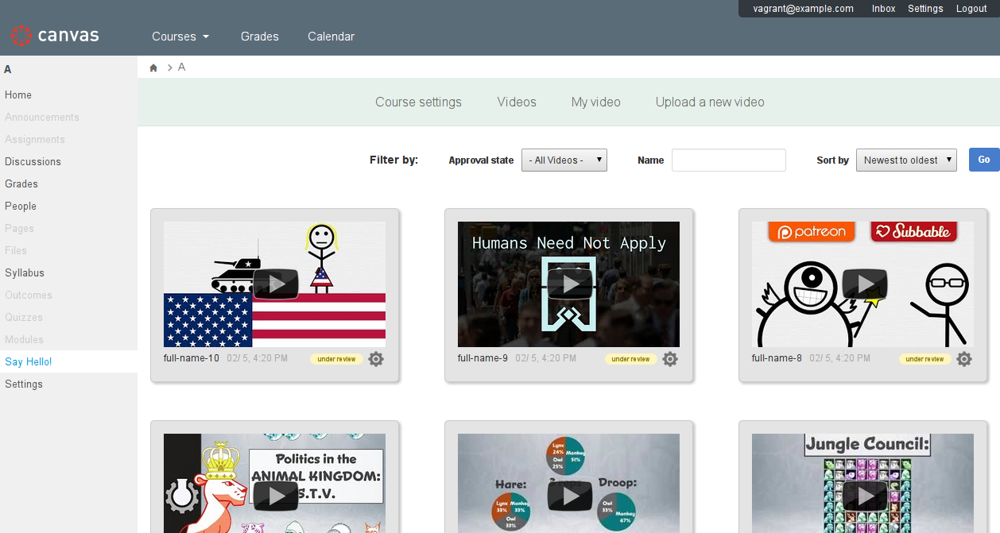

# Hola mundo  

## Overview

This creates a course-level LTI tool that allows your students to introduce
themselves via videos captured with the [youtube upload widget iframe
API](https://developers.google.com/youtube/youtube_upload_widget).

It includes:

* Instructor controls - including video pre-approval and removal,
* A responsive design,
* Basic filter support - name, date, and approval status (where appropriate),
* Video uploads to youtube with the "unlisted" privacy level set.

It's built to work with the [canvas
lms](https://github.com/instructure/canvas-lms) but would probably work with
other LMSs without a ton of effort. PRs welcome!

It's built to be deployed to heroku but should be easily deployed elsewhere.

## Prerequisites:

* A POSIX dev environment,
* ruby 2.1.5 - but any 2.1.x release should work great,
* [foreman](https://github.com/ddollar/foreman) - not strictly necessary but
  it makes development easier,
* a postgres database,
* *Manual acceptance testing only*: A working LTI application consumer, most
  likely [canvas](https://github.com/instructure/canvas-lms).

## Getting Started

After you have cloned this repo, run this setup script to set up your machine
with the necessary dependencies to run and test this app:

    % ./bin/setup

After setting up, you can run the application using foreman:

    % foreman start

This application uses the [dce_lti](https://github.com/harvard-dce/dce_lti)
mountable engine to manage LTI authentication sessions.  You should be familiar
with it before you deploy - it allows you to manage your consumer key and
secret along with other aspects of the LTI transaction.

You can easily get a working canvas-lms environment via our
[canvas_vagrant](https://github.com/harvard-dce/canvas_vagrant) project.

## Testing

Run `bin/setup` as described above. We use rspec for unit and integration
testing.

    % bundle exec rake

## Deploying to production or staging

This app follows [12 factor](http://12factor.net) principles and as such
configuration is done mostly through environment variables. Environment
variables of note:

* LTI_CONSUMER_KEY: a key shared amongst all consumers. This strategy can be
  changed in `config/initializers/dce_lti.rb`.
* LTI_CONSUMER_SECRET: a secret shared amongst all consumers
* NEW_RELIC_LICENSE_KEY: your new relic license key: your app should work fine
  without it.
* COURSE_NAV_TITLE: The title in the course navigation bar. The default is "Say
  Hello!".

You should be sure to clean up nonces with cron via the [dce_lti supplied rake
task](https://github.com/harvard-dce/dce_lti#nonce-cleanup).

## Known issues

* This app relies on cookie-based sessions, which are rejected by default in
  the Safari browser as they are set in an iframe and considered to be "third
  party cookies." We're thinking through a `dce_lti` gem level fix.
* The youtube webcam API requires that a user has a google account and has set
  up a youtube account. First time setup is a bit wonky, but it's out of our
  control.

## Contributing or reporting problems

1. Open a github issue to discuss your problem or feature idea.
1. Fork this repo. Run `./bin/setup`
1. Make sure tests pass: `bundle exec rake`
1. Make your change by writing tests and making sure they pass.
1. Submit a pull request.

We'll try to review ASAP, please be patient.

## Contributors

* Dan Collis-Puro - [djcp](https://github.com/djcp)

## License

This project is licensed under the same terms as Rails itself.

## Copyright

2015 President and Fellows of Harvard College
